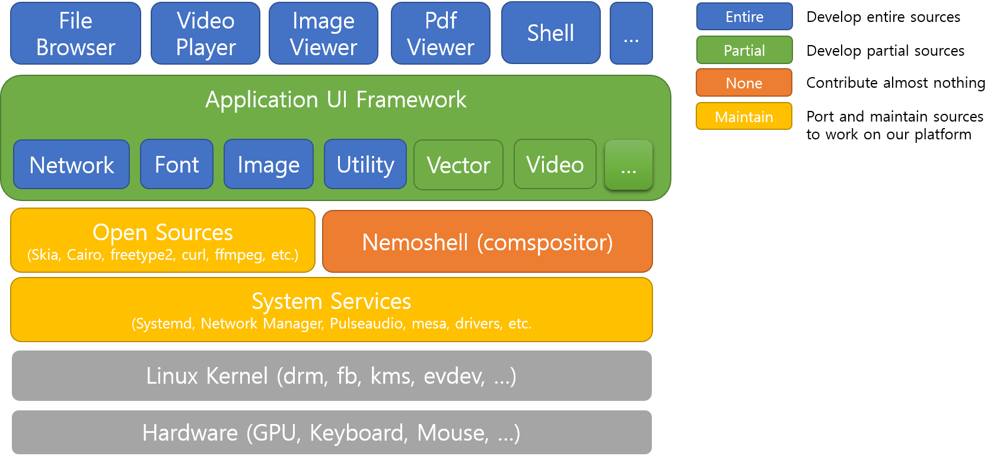

# Senior/Lead Software Engineer
TaeHwan Kim (bluezery) | Shinagawa, 140-0002, Tokyo, Japan

# Interests
* Machine Learning and Web technologies recently.
* Performance profiling and optimization of a software platform or frameworks.
* Developing graphic engines and interactive applications.
* DevOps.

# Executive summary
* Created and managed a software platform based on the Linux.
* Developed frameworks/applications and also supported a large number of 3rd party developers.
* Developed commercial products for various size of devices from tiny screens (Wearable, Mobile) to large/multi screens (TV, tabletop, wall screen).
* Contributed to various open source projects such as [Enlightenment](https://www.enlightenment.org/) and [Tizen](https://www.tizen.org/).
* Conducted performance profiling and optimization on the Linux.

# Technical expertise
* 10+ years experiences in C, C++, Linux, Shell scripting, REST, GDB, Valgrind, git, gerrit, SVN, JIRA, Phabricator, IRC, mailing lists, Bugzilla, Debian/RPM, TETware, Doxygen, SQLite, etc.
* Short experiences with Javascript, HTML/CSS, PHP, MySQL, PostgresSQL, Yocto, Docker.

# Professional Experiences
## Nomad Freelancer Developer, Oct 2017 ~ Present
* Developing Web servers/applications
* Developing iOS applications
* Developing Machine Learning Software

## NEMO-UX, Dec 2014 ~ Oct 2017

* Senior Software Engineer/Architect
* Founding member of NEMO-UX start-up company
* NEMO-UX developer team, 2-3 members
    * Aims to create a futuristic S/W environment
    * Aims to create world's first multi-user platform to support multi-input/output.

* Created a software platform based on Linux, Wayland, and other various open sources.
* Managed the creation and deployment of a software platform.
    * Building, packaging, releasing, installment, documentation, etc.
    * Based on debian, rpm, Yocto, etc.
    * Maintained system libraries and daemons
        * Systemd, Network Manager(or Connman), pulseaudio, mesa, commercial drivers, etc.
* Created essential application frameworks
    - Contributed fully
        + Text engine (based on freetype2, harfbuzz)
        + Connection engine (based on curl)
        + Viewer engine (based on MagickWand, pixman, libjpeg, libpng, pdf)
        + Utilities (based on expat, json-c, dbus, libudev)
    - Contributed partially
        - Window manager server/client engine (based on Wayland)
        - Vector engine (based on Cairo, Skia)
        - Video engine (based on Gstreamer, FFmpeg)
        - Sound engine, Browser engine, etc
* Created main applications for interactive UX (Contributed fully)
    - Basic applications
        + clock, weather, file browser, viewer(images, pdf), video player, keyboard, Status, screen saver, text viewer, usb launcher, etc.
    - Featured applications
        + Multiple player, live streamer, Card shell,  Karim Rashid shell, Space shell, etc.
* Produced various sizes of commercial devices
    * 40' ~ 90' Tabletops, 100' ~ 200' wall screens, etc.
* Demo videos
    - https://www.youtube.com/watch?v=bsTKwx_VNcU
    - https://www.youtube.com/watch?v=F-VnCznz7A0
* Open source
    * Compositor and core.
    - https://github.com/nemoux/nemocore

## Software R&D Center, Samsung Electronics, Feb 2009 ~ Dec 2014
* Summary
    * Developed UI framework based on EFL and system frameworks on the Tizen.
        * Tizen is a standard based S/W platform for multiple device categories. (Mobile, Wearable, TV, IVI, Refrigerator, etc.)
            - https://www.tizen.org/
        * EFL(Enlightenment Foundation Libraries) is a open source and set of library toolkits equivalent to GTK and QT and used by Tizen as a graphic stack.
            * https://www.enlightenment.org/

* EFL open source team, 30 members, May. 2011 ~ Dec. 2014
    * Senior/Lead Software Engineer
    * Supported Tizen commercialization for mobile phones, wearables, and Televisions. (e.g. Samsung Z, Samsung Gear, Samsung TV)
        * Developed various UI widgets(e.g. list, grid, map, popup, etc.)
        * Developed various UI themes
        * Developed and enhanced network library's features and features based on libcurl.
        * Enhanced UI scrolling performance and optimized power consumption.
    * Led packaging, releasing, documentations, testing of EFL on the Tizen from 1.0 to 2.3.

* Map framework, one member, Nov. 2011 ~ Apr. 2012
    * Senior Software Engineer
    * Map framework provides on the Tizen platform interacts with external services and provides Map GUI widgets, Geocoding, Directions, etc.        
    * Designed the architecture and developed based on EFL widgets and integrated external REST services (e.g. Google maps, Here Maps, Decarta maps, OSM, etc.).
    * Supported multi-touch gestures and many other features.

* Location Framework, 2 members, Jan. 2011 ~ Oct. 2011
    * Senior Software Engineer
    * Location framework on the Tizen platform interacts with low-level hardwares, other services and provides APIs for applications.
    * Designed the architecture and developed based on the Geoclue(D-Bus based daemon). Later, we developed our own one to remove glib and D-Bus dependencies later.
    * Developed 3rd party modules such as GPS, WPS(WiFi Positioning Systems), IPS(Indoor Positioning System), HPS(Hybrid Positioning System), etc.

* Telephony Framework, 6 members, Feb. 2009 ~ Dec. 2009
    * Junior Software Engineer
    * Telephony framework on the Tizen platform interacts with radio hardware(e.g. Modem) and provide APIs for applications.
    * Developed framework test toolkits and APIs based on D-Bus.
    * Developed SIM toolkits which yon see it on the hidden menus(equivalent in the IPhone as *#06# for IMEI Info, etc.).

* Open source contributions
    * EFL
        * https://phab.enlightenment.org/search/query/ia23VwHIO7fL/#R
    * Tizen             
        * Because commercialization codes cannot opened and poor histories management, only a few histories are left.
        * Core
            * https://review.tizen.org/git/?p=framework%2Fuifw%2Fecore.git&a=search&h=HEAD&st=author&s=the81.kim%40samsung.com
            * https://review.tizen.org/git/?p=framework%2Fuifw%2Felementary.git&a=search&h=HEAD&st=committer&s=the81.kim%40samsung.com
            * https://review.tizen.org/git/?p=framework%2Fuifw%2Fefl-theme-white.git&a=search&h=HEAD&st=author&s=the81.kim%40samsung.com 
            * https://review.tizen.org/git/?p=framework%2Fuifw%2Fefl-theme-tizen.git&a=search&h=HEAD&st=author&s=the81.kim%40samsung.com
            * https://review.tizen.org/git/?p=framework%2Fuifw%2Fevas.git&a=search&h=HEAD&st=committer&s=the81.kim%40samsung.com
            * https://review.tizen.org/git/?p=framework%2Fuifw%2Feina.git&a=search&h=HEAD&st=author&s=the81.kim%40samsung.com
        * Mobile
            * https://review.tizen.org/git/?p=profile%2Fmobile%2Felementary.git&a=search&h=HEAD&st=author&s=the81.kim%40samsung.com 
            * https://review.tizen.org/git/?p=profile%2Fmobile%2Fevas.git&a=search&h=HEAD&st=author&s=the81.kim%40samsung.com

## Samsung Advanced Institute of Technology, Jul. 2006 ~ Nov. 2006
* Part time Engineer
* Developed network simulator using IBM TAU G2 UML tool and C language.

## AhnLab, Inc, Sept. 2005 ~ Feb. 2006
* ASEC (AhnLab Security Emergency Response Center), 10 members
    * Part time Engineer
    * Verified malwares and developed window analyzing tools using win32/MFC.

# Education
## Sungkyunkwan University, 2000 ~ 2009
M.S. and B.S. in Information and Communication Engineering, SungKyunKwan University, Korea.
* Developed a network simulator and measures various algorithms of wireless networks(e.g. Cognitive Radios).
* Papers
  1. ["Frequency Sharing Mechanism Using Pilot Sensing in OFDMA-Based Cognitive Radio Networks,"](https://www.jstage.jst.go.jp/article/transcom/E94.B/4/E94.B_4_986/_article) IEICE Trans. on Communications, vol. E94-B
  2. ["Throughput Enhancement of Macro and Femto Networks by Frequency Reuse and Pilot Sensing,"](http://ieeexplore.ieee.org/document/4745099/) in Proc. of IEEE International Workshop on Generation C Wireless Networks 2008, Austin, USA, pp. 390-394, Dec. 2008
  3. ["Spectrum Allocation Algorithms for Uplink Sub-carriers in OFDMA-Based Cognitive Radio Networks,"](http://ieeexplore.ieee.org/document/4430368/) in Proc. of IEEE International Conference on Innovations in Information Technology (Innovations 2007), Dubai, United Arab Emirates, pp. 51-54, Oct. 2007.
